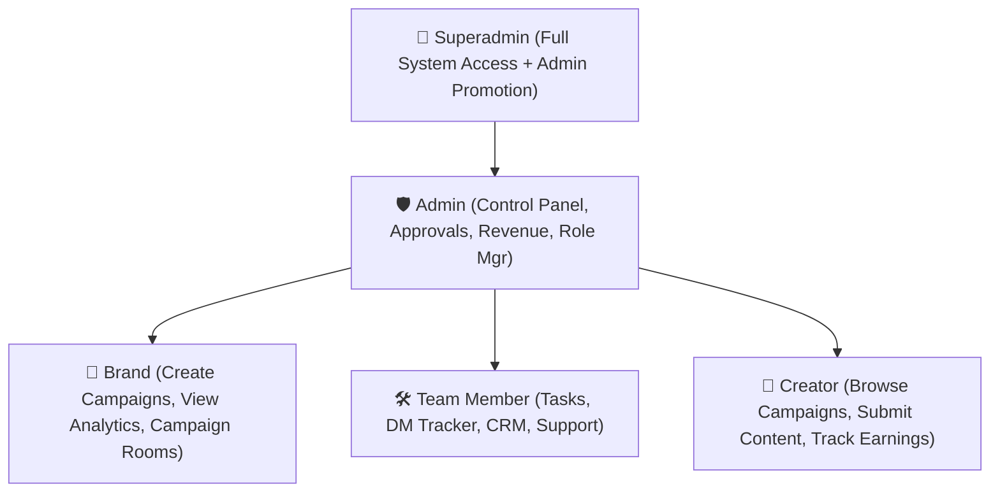

# CreatoKite 🚀

> **AI-Powered Creator Campaign Operating System**  
> Streamline influencer marketing, automate creator vetting via the **Creator Automation Score (CAS)** engine, and manage high-impact campaigns seamlessly.


---

## 📋 Table of Contents

- [Overview](#-overview)
- [Key Features](#-key-features)
- [Tech Stack](#-tech-stack)
- [Creator Automation Score (CAS)](#-creator-automation-score-cas)
- [Role Hierarchy & Permissions](#-role-hierarchy--permissions)
- [Project Architecture](#-project-architecture)
- [Quick Start Guide](#-quick-start-guide)
- [Environment Variables](#-environment-variables)
- [Demo Credentials](#-demo-credentials)
- [Useful Scripts](#-useful-scripts)
- [Documentation & Deployment](#-documentation--deployment)

---

## 🌐 Overview

**CreatoKite** is an end-to-end platform designed for brands, agencies, and creators. It automates campaign management, tracking, and creator discovery while utilizing data-backed risk scoring and social media scraping (YouTube & Instagram) to eliminate influencer fraud and streamline approvals.

---

## ✨ Key Features

### 🎯 **Creator Automation Score (CAS) Engine**
- **Automated Vetting:** Analyzes YouTube & Instagram profile data to calculate a weighted engagement & authenticity score.
- **Risk Assessment:** Categorizes creators into **LOW**, **MEDIUM**, or **HIGH** risk levels.
- **Auto-Approval Workflow:** Creators meeting auto-approval rules (CAS ≥ 75 & LOW risk) bypass manual review.

### 👥 **Role-Based Access Control (RBAC)**
- Customized portals tailored for **Superadmin**, **Admin**, **Brand**, **Team Member**, and **Creator** users.
- Role management & promotion tools directly inside the Admin Dashboard.

### 💬 **Real-time Collaboration & CRM**
- **Campaign Rooms & DM Tracker:** Live messaging and status updates via **Socket.io**.
- **Task Management & Workflow:** Milestone tracking, task assignment, and submission reviews.

### 📊 **Campaign & Creator Analytics**
- Interactive data visualizations powered by **Recharts**.
- Engagement breakdowns, follower growth trajectories, audience quality, and conversion metrics.

### 🛡️ **Enterprise Security Hardening**
- Rate limiting (`express-rate-limit`), security headers (`helmet`), input sanitization (`express-mongo-sanitize`), request validation (`express-validator`), and JWT authentication with refresh token strategies.

---

## 🛠️ Tech Stack

### **Frontend**
- **Framework:** React 18 + Vite (ESM)
- **Routing:** React Router v6
- **State & UI:** Framer Motion, Lucide React Icons, React Hot Toast
- **Data Visualization:** Recharts
- **Real-time:** Socket.io Client
- **HTTP Client:** Axios

### **Backend**
- **Runtime:** Node.js 20.x
- **Framework:** Express 4.x
- **Database:** MongoDB + Mongoose ORM
- **Scraping & Automation:** Playwright, Puppeteer Extra Stealth, Apify Client
- **Real-time:** Socket.io
- **Auth & Security:** JWT, Passport.js (Google OAuth 2.0), Helmet, BcryptJS, Cookie-Parser
- **Email & Notifications:** Resend API, Nodemailer

---

## 📊 Creator Automation Score (CAS)

The CAS scoring model evaluates creators across 8 key dimensions:

| Dimension | Weight | Target Criteria |
| :--- | :--- | :--- |
| **Engagement Quality** | 20% | Likes-to-comments ratio, bot activity analysis |
| **Audience Reach** | 15% | Impression depth, subscriber benchmark |
| **Authenticity** | 15% | Account age, verification, follower-to-following ratio |
| **Consistency** | 10% | Upload frequency, regular content scheduling |
| **Growth Trajectory** | 10% | Steady organic follower growth over 90 days |
| **Brand Safety** | 10% | Toxicity & policy compliance scans |
| **Conversion Potential** | 10% | Historical CTR and audience demography alignment |
| **Content Quality** | 10% | Visual resolution, caption depth, metadata quality |

### **Tier Badges**
- 🏆 **ELITE** — CAS ≥ 90
- ✅ **VERIFIED** — 75 ≤ CAS < 90
- 🔹 **STANDARD** — 50 ≤ CAS < 75
- ⚠️ **REVIEW** — CAS < 50

---

## 🔐 Role Hierarchy & Permissions



---

## 📂 Project Architecture

```text
CreatoKite/
├── backend/
│   ├── src/
│   │   ├── config/        # Database & auth configuration
│   │   ├── controllers/   # Route handling logic
│   │   ├── middleware/    # Auth, validation, rate limiting
│   │   ├── models/        # Mongoose schemas
│   │   ├── routes/        # Express API endpoints
│   │   ├── services/      # CAS calculation, scraping, email, Socket.io
│   │   ├── seed.js        # Data seeder script
│   │   └── server.js      # App entry point
│   ├── package.json
│   └── .env.example
├── frontend/
│   ├── src/
│   │   ├── components/    # Reusable UI components
│   │   ├── pages/         # Dashboard & role views
│   │   ├── context/       # Auth & state contexts
│   │   ├── services/      # API client definitions
│   │   ├── App.jsx        # Routing & layout setup
│   │   └── main.jsx       # Entry point
│   ├── package.json
│   └── vite.config.js
├── SETUP.md               # Detailed local setup instructions
├── DEPLOY.md              # Production deployment guide
└── CHANGES.md             # Changelog history
```

---

## ⚡ Quick Start Guide

### **Prerequisites**
- **Node.js** v20.x or higher
- **npm** v10.x or higher
- **MongoDB** instance (Local or MongoDB Atlas)

---

### **1. Clone & Install Dependencies**

```bash
# Clone the repository
git clone <repository-url>
cd creatokite

# Install backend dependencies
cd backend
npm install

# Install frontend dependencies
cd ../frontend
npm install
```

---

### **2. Environment Configuration**

Create a `.env` file in the `backend/` directory:

```bash
cd backend
cp .env.example .env
```

Fill in required variables:

```env
PORT=5000
MONGODB_URI=mongodb+srv://<user>:<password>@cluster.mongodb.net/creatokite
JWT_SECRET=your_super_secret_jwt_key_32_chars
JWT_REFRESH_SECRET=your_super_secret_refresh_key_32_chars
COOKIE_SECRET=your_cookie_secret_key
CLIENT_URL=http://localhost:5173
RESEND_API_KEY=re_123456789 # Optional for email service
```

---

### **3. Seed Initial Demo Data**

Populate the database with demo users, roles, campaigns, and sample CAS metrics:

```bash
cd backend
npm run seed
```

---

### **4. Start the Application**

Run backend and frontend servers in separate terminals:

```bash
# Terminal 1: Backend API (http://localhost:5000)
cd backend
npm run dev

# Terminal 2: Frontend Client (http://localhost:5173)
cd frontend
npm run dev
```

Open `http://localhost:5173` in your browser.

---

## 🔑 Demo Credentials

*(Available after running `npm run seed`)*

| Role | Email | Password | Access Level |
| :--- | :--- | :--- | :--- |
| **Superadmin** | `admin@creatokite.com` | `Admin@12345` | Full system control & role manager |
| **Brand** | `brand@demo.com` | `Demo@12345` | Campaign creation & creator sourcing |
| **Creator** | `creator1@demo.com` | `Demo@12345` | Application submissions & CAS dashboard |

---

## 📜 Useful Scripts

### **Backend (`backend/package.json`)**
- `npm run dev` — Starts dev server with hot-reload via `nodemon`.
- `npm start` — Starts production server (`node src/server.js`).
- `npm run seed` — Seeds database with initial demo data.
- `npm run setup` — Configures Instagram scraping and Playwright dependencies.

### **Frontend (`frontend/package.json`)**
- `npm run dev` — Starts Vite development server.
- `npm run build` — Compiles optimized production bundle into `dist/`.
- `npm run preview` — Previews production build locally.

---

## 📖 Documentation & Deployment

For deeper guidance, refer to:
- 📖 [SETUP.md](./SETUP.md) — Comprehensive environment setup & integration details.
- 🚀 [DEPLOY.md](./DEPLOY.md) — Production deployment instructions (Netlify / Vercel / Render / AWS).
- 📝 [CHANGES.md](./CHANGES.md) — Release notes and changelog history.

---

## 📄 License

This project is released under the **MIT License**.

